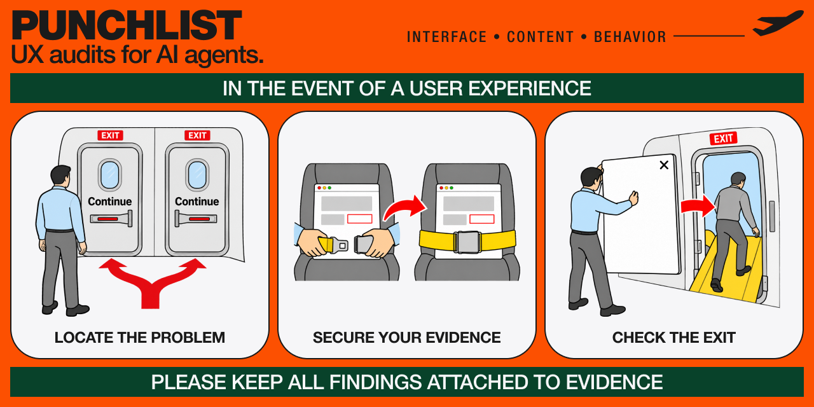

# Punchlist



[](https://github.com/xenstalker02/punchlist/actions/workflows/validate.yml)

See the whole system before setting it up: [synthetic HTML report](examples/synthetic/report.html) and [synthetic PDF report](examples/synthetic/report.pdf). They are generated from an invented product and invented evidence, so they show the recipient-facing output without exposing an audit of a real organization.

Punchlist is a named-defect UX audit protocol for AI coding agents. A recipient gets a readable report that follows one task, shows evidence next to each decision-relevant finding, records what held up, and names work that the available input could not assess.

> **Status: v0.1 production-ready.** The validated audit-to-report pipeline is ready for its declared capabilities. Future incompatible schema changes will be versioned explicitly rather than silently changing this contract.

## Traceability

An evaluation brief and authorized inputs produce a canonical audit bundle. It is the source record for scope, provenance, eligibility, evidence, critic decisions, findings, gaps, and limits. The recipient projection lists stable IDs from that bundle, and the renderer validates both inputs before producing self-contained HTML. PDF is printed from that verified HTML.

```text
brief + authorized inputs -> canonical audit -> report projection -> HTML -> PDF
```

The renderer calculates counts and refuses unresolved IDs, unsafe values, unapproved evidence, or a failed redaction check. Reports do not use a defect total as a score or product verdict.

## Quick start

Install the skill with your preferred agent-skill workflow:

```sh
npx skills add xenstalker02/punchlist
```

Or clone the repository for a local Claude Code skill directory:

```sh
git clone https://github.com/xenstalker02/punchlist.git ~/.claude/skills/punchlist
```

Give the agent a target it is authorized to inspect, then start with this exact neutral brief:

```text
A `[user]`, in `[state]` on `[device]`, starts at `[entry point]` and tries to `[complete task]`; `[profile]` profile. Severity basis: `[basis]`.
```

`experience` is the default for a product, screen, or flow. Choose `implementation` for accessibility, semantics, code, conformance, or design-system QA. Declare the severity basis before inspection so critics rate the same kind of task impact.

To generate both formats from any validated audit and its recipient projection, create the ignored `output/` directory, then use the same data inputs for both commands:

```sh
python scripts/render_report.py --audit path/to/audit.json --report path/to/report.json --output output/report.html
npm run report:pdf -- --audit path/to/audit.json --report path/to/report.json --output output/report.pdf
```

The PDF command validates and renders the data again into a unique ignored temporary file, prints only that self-contained result, and removes it. It never accepts an arbitrary HTML file. The only HTML input mode is reserved for verifying the committed synthetic fixture:

```sh
npm run report:pdf -- --input examples/synthetic/report.html --output output/synthetic-report.pdf
```

To apply a bounded platform accent, pass the same optional adapter to both data commands. In v0.1 the generated report may change the platform name, primary accent, supporting tone, evidence treatment, and visible source reference. It cannot change the project owner's typography, grid, spacing, report anatomy, or attribution:

```sh
python scripts/render_report.py --audit path/to/audit.json --report path/to/report.json --theme themes/platform-accent.example.json --output output/report.html
npm run report:pdf -- --audit path/to/audit.json --report path/to/report.json --theme themes/platform-accent.example.json --output output/report.pdf
```

## Capability matrix

| Mode | What it needs | What it can establish |
| --- | --- | --- |
| Single-agent minimum | One agent and an authorized URL, screenshot, or Figma input | A bounded audit bundle. Checks without supporting evidence stay under Not assessed. |
| Full review | Three to five independent critics, plus browser or Playwright access for live behavior | Independent observations, a closed eligibility ledger, merged severity decisions, and an evidence-led report. |
| Screenshot or Figma | A supplied frame or available structural read | Pixel and exposed structural checks. It cannot prove omission, reachability, or behavior outside the captured state. |
| Render and PDF | Python for HTML; Node, Playwright, and Chromium for PDF and visual tests | Self-contained HTML, plus a browser-verified PDF of the same report. |

The full mode is the protocol’s intended evaluation method. A single agent may still assemble a useful, limited report when it keeps the evidence boundary visible.

## Privacy and authorization

Preflight defaults to **public and logged-out** surfaces. Authenticated, private, customer, employer, or NDA-bound material needs explicit scope and an `authorized-restricted` classification before inspection. Restricted evidence and output remain restricted unless publication receives separate approval.

Before critics receive material, record the authorized surfaces, permitted recipients, whether external or model subagents may receive evidence, allowed evidence types, and retention requirements. Redact local paths, credentials, private URLs, personal emails, customer identifiers, and unapproved screenshots. `.gitignore` keeps generated files out of a normal commit; it does not protect confidential data.

## Report appearance

The default `punchlist-default` theme carries the project owner’s portfolio system into a report: editorial hierarchy, evidence frames, square geometry, restrained deep-sapphire emphasis, and accessible public font fallbacks. In v0.1, a `platform-accent` adapter may change the generated report’s platform name, primary accent, supporting tone, evidence treatment, and visible source reference. It cannot replace the report’s typography, grid, spacing, page anatomy, attribution, evidence hierarchy, severity language, or accessibility requirements. Generated reports do not render platform logos in v0.1; an approved public logo is only a Figma/social-cover capability when the project owner separately directs that visual work.

Every report credits Punchlist contributors, Product Designer, and [github.com/xenstalker02/punchlist](https://github.com/xenstalker02/punchlist).

## Validation

The renderer runtime uses the Python standard library. Full repository validation also inspects committed public PDFs with the dev-only PyMuPDF dependency from `requirements-dev.txt`; browser report checks need the development dependencies and Chromium described in [CONTRIBUTING.md](CONTRIBUTING.md).

```sh
python -m pip install -r requirements-dev.txt
python scripts/validate.py
python -m unittest discover -s tests -v
npm run test:report
```

The first two commands validate the taxonomy, schemas, synthetic bundle, public-safety checks, documentation links, and internal references. The Playwright command opens the synthetic report at normal reading size and verifies its print output.

## Known limits

- A group of agents using the same model does not have the independence of evaluators with different training and experience.
- Input constrains the claim: a screenshot cannot prove a control is unreachable or content is absent beyond its frame.
- Browser verification depends on a locally installed Chromium browser; HTML generation still works without it.
- The repository makes no precision, recall, coverage, or time-saved claim. A report is evidence for one declared task, not a quality certification.

## Contributing and support

Read [CONTRIBUTING.md](CONTRIBUTING.md) for local setup and evidence expectations, [SUPPORT.md](SUPPORT.md) for compatibility and issue help, [SECURITY.md](SECURITY.md) for vulnerability reporting, and [CODE_OF_CONDUCT.md](CODE_OF_CONDUCT.md) for participation standards. Maintainers use [RELEASING.md](RELEASING.md) for every authorized release.

## License

MIT. See [LICENSE](LICENSE).
